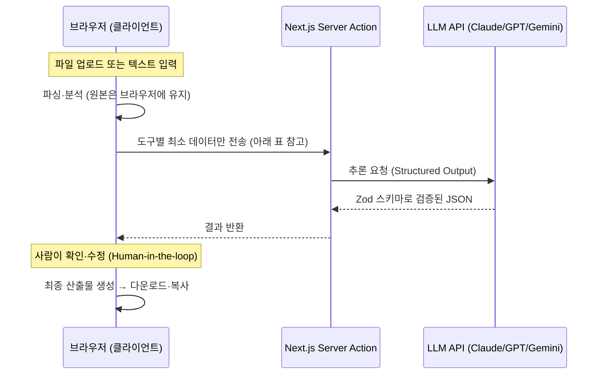

# 📎 Office AI Toolbox

> **반복되는 사무 작업, AI에게 맡기세요.**
> 매주 손으로 하던 엑셀 취합·문서 정리를 몇 번의 클릭으로 끝내는 사무용 AI 도구 모음입니다.


---

## 🔒 내 데이터는 안전한가요? — 이 프로젝트의 가장 중요한 약속

**업로드한 파일의 원본 데이터는 브라우저 밖으로 나가지 않습니다.**

일반적인 AI 서비스는 파일 전체를 서버에 업로드해서 처리합니다. 회사의 매출 자료, 직원 명단, 고객 정보가 통째로 외부 서버에 올라간다는 뜻입니다. 이 도구함은 다르게 동작합니다.

```
일반적인 AI 서비스                Office AI Toolbox
─────────────────                ─────────────────
파일 전체를 서버로 전송 ❌        파일은 내 브라우저 안에서만 처리 ✅
데이터가 외부에 저장됨 ❌         서버에 아무것도 저장하지 않음 ✅
                                 AI에는 "컬럼 제목 + 샘플 몇 줄"만 전송 ✅
```

엑셀 취합을 예로 들면, AI가 전달받는 것은 `"성명", "입사일", "부서"` 같은 **컬럼 제목과 형식 파악용 샘플 몇 줄**이 전부입니다. 수천 행의 실제 데이터는 여러분의 브라우저 안에서만 읽히고, 합쳐지고, 다운로드됩니다. 서버는 그 데이터를 만질 수도, 저장할 수도 없는 구조입니다.

### 도구별 AI 전송 범위

도구마다 AI로 나가는 데이터의 범위가 다릅니다. 아래 표에서 각 도구가 **무엇을 보내고 무엇을 보내지 않는지** 정확히 확인할 수 있습니다.

| 도구 | AI에 전송되는 것 | 전송되지 않는 것 |
|---|---|---|
| 엑셀 취합 | 컬럼 헤더 + 샘플 최대 5행 (+값 통일 사용 시 해당 컬럼 고유값) | 전체 행 데이터 |
| PPT 린터 | (AI 요약 사용 시) 글꼴·색상·위반 통계 | 슬라이드 본문 텍스트, 이미지 |
| 개조식 변환기 | **입력한 텍스트 전체** (변환 기능의 본질상 필요) | — (서버 저장 없음) |
| 인수인계서 생성 | **입력한 업무 정보 전체** (문서 정리의 본질상 필요) | — (서버 저장 없음) |
| 문서 버전 비교 | (AI 요약 사용 시) **변경된 문단의 원문·수정문** | 변경되지 않은 문단, .docx 파일 원본 |

**개조식 변환기와 인수인계서 생성은 성격상 텍스트 자체를 전송해야만 동작합니다.** 대신 앱은 이 텍스트를 서버에 저장하지 않으며, 처음 사용할 때 확인 다이얼로그로 "텍스트가 AI로 전송된다"는 사실을 명시적으로 안내합니다. 인수인계서 도구는 한 번에 전송할 입력 상한을 직접 선택할 수 있습니다(1,000자 단위, 기본 5,000자·최대 30,000자). 회사 기밀·개인정보가 포함된 텍스트는 조직의 보안 정책을 확인한 뒤 사용하세요.

**문서 버전 비교**는 문단 비교 자체가 브라우저에서 끝나며(.docx 파싱 포함), AI 요약을 실행할 때만 **변경된 문단(추가·삭제·수정)의 원문·수정문**만 전송합니다. 변경되지 않은 문단과 .docx 원본 파일은 전송하지 않으며, 전송 텍스트에는 30,000자 절대 상한이 서버에서 강제됩니다.

---

## 🧰 도구 목록

| 도구 | 하는 일 | 상태 |
|---|---|---|
| **엑셀 취합** | 팀마다 양식이 제각각인 엑셀 파일들을 AI가 컬럼 의미를 이해해 하나의 표준 양식으로 취합 | ✅ 사용 가능 |
| **PPT 린터** | 슬라이드의 폰트·색·정렬 불일치를 검사하고 통일 | ✅ 사용 가능 (검사·리포트) |
| **개조식 변환기** | 서술형 줄글과 보고서용 개조식(□ ○ 계층·명사형 종결) 문체를 양방향 변환 | ✅ 사용 가능 |
| **인수인계서 생성** | 가이드형 폼에 적은 업무 정보를 표준 인수인계서 구조로 정리하고, 빠진 정보를 체크리스트로 지적 (.docx 다운로드) | ✅ 사용 가능 |
| **문서 버전 비교** | 두 문서 버전의 변경(추가·삭제·수정)을 문단 단위로 비교하고, 필요하면 AI가 의미 단위로 요약 (.docx 업로드·붙여넣기) | ✅ 사용 가능 |

### 왜 "엑셀 취합"이 첫 번째인가?

각 부서에서 보낸 엑셀 파일은 컬럼명이 다르고(`성명` vs `이름` vs `담당자`), 날짜 형식이 다르고, 순서도 다릅니다. 지금까지는 사람이 하나하나 복사·붙여넣기로 맞춰왔습니다. 규칙 기반 도구로는 "양식이 제멋대로인 파일"을 처리할 수 없었지만, LLM은 컬럼의 **의미**를 이해하기 때문에 가능해졌습니다. 이 도구는 AI가 제안한 매핑을 **사람이 확인·수정한 뒤** 병합하므로, AI가 틀려도 결과물은 안전합니다.

## 🏗️ 아키텍처

모든 도구는 같은 파이프라인을 공유합니다 — **처리는 브라우저에서, AI에는 도구별 최소 정보만**:



### 도구별 처리 흐름

| 도구 | 브라우저에서 처리 | AI에 전송 | AI가 반환 | 최종 산출물 (브라우저 생성) |
|---|---|---|---|---|
| 엑셀 취합 | ExcelJS 파싱 → 병합 → 날짜·전화번호 결정적 정규화 | 컬럼 헤더 + 샘플 ≤5행 (옵트인: 컬럼 고유값) | 컬럼 매핑 + 변환 형식 토큰 | 취합 결과 .xlsx |
| PPT 린터 | zip 안전 해제(폭탄 방어) → XML 분석 → 규칙 5종 검사 | (옵트인) 글꼴·색상·위반 통계만 | 개선 권고 리포트 | 슬라이드별 위반 리포트 |
| 개조식 변환기 | 프리셋 기호(□ ○ -) 결정적 조립 | 입력 텍스트 전체 | 계층 구조화된 문장 | 변환 텍스트 (복사) |
| 인수인계서 생성 | .docx 문서 생성 (docx) | 입력한 업무 정보 전체 | 문서 섹션 + 보완 체크리스트 | 인수인계서 .docx / 마크다운 |
| 문서 버전 비교 | zip 안전 해제 → .docx 텍스트 추출 → 문단·단어 LCS 비교 | (옵트인) 변경된 문단의 원문·수정문 | 변경 그룹 요약 + 중요도 | 나란히·통합 diff 뷰 |

공통 원칙: AI가 형식·구조를 **제안**하면 변환·조립·문서 생성 같은 실행은 전부 브라우저의 결정적 코드가 수행합니다. LLM 출력이 코드로 실행되는 경로는 없습니다.

설계 원칙:

- **클라이언트 우선 처리** — 파일 파싱·병합·다운로드는 전부 브라우저(ExcelJS)에서 수행. 서버는 무상태(stateless)이며 파일을 저장하지 않음
- **최소 전송** — LLM에는 매핑 추론에 필요한 최소 정보(헤더 + 샘플)만 전달. 호출당 비용도 수백 토큰 수준. 값 통일 기능을 사용할 때만(선택) 해당 컬럼의 고유값 목록이 추가로 전송됩니다
- **구조화 출력** — LLM 응답은 Zod 스키마로 검증된 JSON으로 강제. 파싱 실패로 UI가 깨지는 경로 자체를 제거
- **Human-in-the-loop** — AI 제안은 반드시 사람의 확인 단계를 거친 뒤 적용

## 🛠️ 기술 스택

| 영역 | 기술 | 비고 |
|---|---|---|
| 프레임워크 | Next.js 16 (App Router) | Server Actions로 API 키를 서버에만 격리 |
| 언어 | TypeScript | |
| UI | Tailwind CSS 4 + shadcn/ui | |
| 엑셀 처리 | ExcelJS | 브라우저에서 읽기/쓰기/스타일 처리 |
| 문서 처리 | JSZip · fast-xml-parser · docx | .pptx·.docx 안전 해제·XML 분석, .docx 생성 — 전부 브라우저에서 수행 |
| AI | Claude · GPT · Gemini (사용자 선택) | `@anthropic-ai/sdk` · `openai` · `@google/genai` |
| 스키마 검증 | Zod | LLM 응답의 타입 안전성 보장 |

## 🚀 시작하기

### 1. 설치

```bash
git clone https://github.com/daewonLims/office-ai-toolbox.git
cd office-ai-toolbox
pnpm install
```

### 2. 환경변수 설정

`.env.example`을 복사해 `.env.local`을 만들고, **사용할 프로바이더의 키만** 입력합니다. 세 개를 모두 넣을 필요는 없습니다 — 하나만 설정해도 동작합니다.

```bash
cp .env.example .env.local
```

| 키 이름 | 프로바이더 | 발급처 | 필수 여부 |
|---|---|---|---|
| `ANTHROPIC_API_KEY` | Claude (Anthropic) | https://console.anthropic.com/settings/keys | 택1 |
| `OPENAI_API_KEY` | GPT (OpenAI) | https://platform.openai.com/api-keys | 택1 |
| `GEMINI_API_KEY` | Gemini (Google) | https://aistudio.google.com/app/apikey | 택1 |

> 셋 중 **최소 하나**만 설정하면 됩니다. 설정한 프로바이더만 앱의 "AI 모델" 드롭다운에서 선택할 수 있고, 나머지는 "키 미설정"으로 비활성화됩니다. 모델 이름은 `ANTHROPIC_MODEL` · `OPENAI_MODEL` · `GEMINI_MODEL` 환경변수로 재정의할 수 있습니다.

> ⚠️ **`.env.local`은 절대 커밋하지 마세요.** 이 저장소의 `.gitignore`는 `.env*` 전체를 무시하고 `.env.example`(키 이름만 있는 템플릿)만 예외로 허용하도록 설정되어 있습니다.

### 3. 실행

```bash
pnpm dev
```

[http://localhost:3000](http://localhost:3000) 에서 확인할 수 있습니다. 바로 써볼 수 있는 테스트 파일이 `sample-data/`에 준비되어 있습니다.

## 🛡️ 보안 설계

이 저장소는 공개를 전제로 다음 원칙을 지킵니다.

1. **시크릿은 코드에 존재하지 않음** — API 키는 `.env.local`(git 미추적)에만 존재하며, 소스 어디에도 하드코딩하지 않습니다
2. **API 키는 서버에만 격리** — AI 호출 모듈은 `server-only` 패키지로 보호되어, 클라이언트 번들에 실수로 포함되면 빌드가 실패합니다. 클라이언트에는 각 프로바이더의 **사용 가능 여부(boolean)만** 전달됩니다
3. **사용자 데이터 무저장** — 업로드 파일·입력 텍스트는 서버에 저장되지 않으며, DB 자체가 없습니다
4. **최소 데이터 전송** — AI로 나가는 데이터는 도구별로 필요한 최소 범위로 제한합니다 (위 "도구별 AI 전송 범위" 표 참고). 텍스트 전체가 필요한 도구는 첫 사용 시 확인 다이얼로그로 명시 고지합니다
5. **악성 파일 방어** — .pptx·.docx(zip) 처리 시 매직 바이트 검증, 압축 폭탄 방어(엔트리 수·해제 크기 상한), 경로 화이트리스트, XXE 차단(DOCTYPE 거부·엔티티 비활성)을 적용합니다. 이 방어는 공유 코어(`lib/safe-zip`)로 승격되어 zip 기반 도구가 동일하게 사용합니다
6. **LLM 출력은 실행하지 않음** — AI 응답은 Zod 스키마로 검증된 데이터로만 취급하며, 코드로 실행되는 경로가 없습니다. 날짜 변환·기호 조립·문서 생성은 전부 화이트리스트된 결정적 코드가 수행합니다
7. **서버측 입력 검증** — 모든 서버 액션 입력은 Zod로 검증합니다(파일 수·글자 수 상한, enum, 프로바이더 가용성). 사용자가 선택한 입력 상한도 서버에서 재검증하며 절대 상한(30,000자)은 클라이언트 값과 무관하게 강제됩니다. 인수인계서 도구는 입력에 섞인 자격증명 값을 문서로 옮기지 않도록 치환 지시를 두고, UI에서도 입력 자제를 경고합니다

## 📁 프로젝트 구조

```
features/                    # 도구별 자급자족 모듈 (도구 로직의 단일 소재지)
├─ excel-merge/              # 도구 1: 엑셀 취합 (파싱/매핑/병합/정규화)
├─ ppt-lint/                 # 도구 2: PPT 린터 (safe-zip/규칙 5종/리포트)
├─ outline-converter/        # 도구 3: 개조식 변환기 (프리셋 기호 조립)
├─ handover-generator/       # 도구 4: 인수인계서 생성 (docx/보완 체크리스트)
└─ doc-diff/                 # 도구 5: 문서 버전 비교 (docx 추출/LCS diff/AI 요약)
   ※ 각 모듈 공통 구조: index.ts(공개 API) · actions.ts("use server")
     · components/(전용 UI) · lib/(전용 로직)
app/
├─ layout.tsx                # 공통 셸 (접이식 사이드바)
├─ page.tsx                  # 랜딩 — 도구 카드 그리드 + 전송 수준 배지
├─ icon.svg                  # 앱 아이콘 (파비콘)
└─ tools/<slug>/page.tsx     # 도구별 얇은 라우트 (~10줄): features 페이지 렌더
lib/                         # 공유 코어 전용 (도구 전용 코드는 두지 않음)
├─ ai/                       # 공유 AI 코어 (Claude/GPT/Gemini, server-only)
├─ safe-zip.ts               # 악성 zip(OOXML) 방어 공유 코어 (ppt-lint·doc-diff 공용)
├─ tools.ts                  # 도구 메타데이터 (이름·경로·상태·전송수준·아이콘의 단일 소스)
└─ utils.ts                  # 공유 유틸
components/                  # 공유 UI
├─ sidebar.tsx               # 접이식 사이드바
├─ provider-select.tsx       # AI 프로바이더 선택
└─ ui/                       # shadcn/ui 컴포넌트
sample-data/                 # 데모용 가상 데이터(.xlsx/.pptx) + 생성 스크립트
```

새 도구는 `features/<이름>/` 폴더(자급자족 모듈) + `app/tools/<이름>/` 얇은 라우트 + `lib/tools.ts` 메타데이터 한 줄로 추가됩니다.

## 🗺️ 로드맵

- [x] 프로젝트 셋업 · 도구함 셸
- [x] 엑셀 취합 — 파일 업로드 + 클라이언트 파싱
- [x] 엑셀 취합 — AI 컬럼 매핑 (Structured Output)
- [x] 엑셀 취합 — 매핑 검토 UI + 병합·다운로드
- [x] PPT 린터
- [x] 개조식 변환기
- [x] 인수인계서 생성
- [x] 문서 버전 비교

## 📄 라이선스

[MIT](LICENSE)
