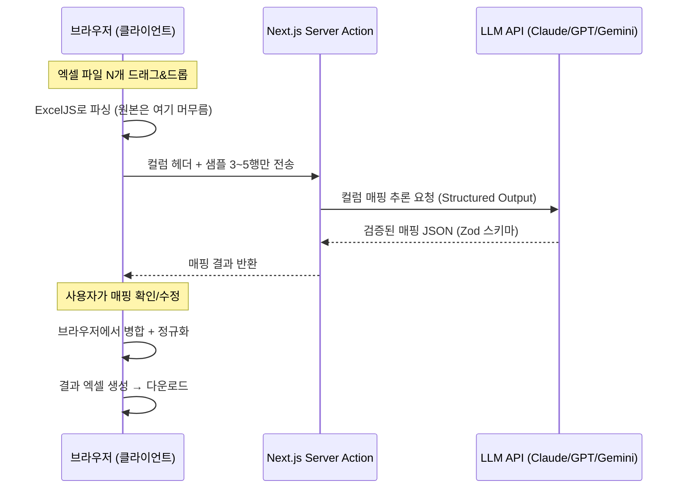

# 📎 Office AI Toolbox

> **반복되는 사무 작업, AI에게 맡기세요.**
> 매주 손으로 하던 엑셀 취합·문서 정리를 몇 번의 클릭으로 끝내는 사무용 AI 도구 모음입니다.


---

## 🔒 내 데이터는 안전한가요? — 이 프로젝트의 가장 중요한 약속

**업로드한 파일의 원본 데이터는 브라우저 밖으로 나가지 않습니다.**

일반적인 AI 서비스는 파일 전체를 서버에 업로드해서 처리합니다. 회사의 매출 자료, 직원 명단, 고객 정보가 통째로 외부 서버에 올라간다는 뜻입니다. 이 도구함은 다르게 동작합니다.

```
일반적인 AI 서비스                Office AI Toolbox
─────────────────                ─────────────────
파일 전체를 서버로 전송 ❌        파일은 내 브라우저 안에서만 처리 ✅
데이터가 외부에 저장됨 ❌         서버에 아무것도 저장하지 않음 ✅
                                 AI에는 "컬럼 제목 + 샘플 몇 줄"만 전송 ✅
```

엑셀 취합을 예로 들면, AI가 전달받는 것은 `"성명", "입사일", "부서"` 같은 **컬럼 제목과 형식 파악용 샘플 몇 줄**이 전부입니다. 수천 행의 실제 데이터는 여러분의 브라우저 안에서만 읽히고, 합쳐지고, 다운로드됩니다. 서버는 그 데이터를 만질 수도, 저장할 수도 없는 구조입니다.

---

## 🧰 도구 목록

| 도구 | 하는 일 | 상태 |
|---|---|---|
| **엑셀 취합** | 팀마다 양식이 제각각인 엑셀 파일들을 AI가 컬럼 의미를 이해해 하나의 표준 양식으로 취합 | ✅ 사용 가능 |
| **PPT 린터** | 슬라이드의 폰트·색·정렬 불일치를 검사하고 통일 | ✅ 사용 가능 (검사·리포트) |
| 개조식 변환기 | 서술형 초안을 보고서용 개조식 문체로 변환 | 📋 예정 |
| 인수인계서 생성 | 업무 자료를 훑어 인수인계 문서 초안 작성 | 📋 예정 |
| 문서 버전 비교 | "최종_진짜최종.docx" 문제 해결 — 버전 간 변경 내용을 의미 단위로 요약 | 📋 예정 |

### 왜 "엑셀 취합"이 첫 번째인가?

각 부서에서 보낸 엑셀 파일은 컬럼명이 다르고(`성명` vs `이름` vs `담당자`), 날짜 형식이 다르고, 순서도 다릅니다. 지금까지는 사람이 하나하나 복사·붙여넣기로 맞춰왔습니다. 규칙 기반 도구로는 "양식이 제멋대로인 파일"을 처리할 수 없었지만, LLM은 컬럼의 **의미**를 이해하기 때문에 가능해졌습니다. 이 도구는 AI가 제안한 매핑을 **사람이 확인·수정한 뒤** 병합하므로, AI가 틀려도 결과물은 안전합니다.

## 🏗️ 아키텍처



설계 원칙:

- **클라이언트 우선 처리** — 파일 파싱·병합·다운로드는 전부 브라우저(ExcelJS)에서 수행. 서버는 무상태(stateless)이며 파일을 저장하지 않음
- **최소 전송** — LLM에는 매핑 추론에 필요한 최소 정보(헤더 + 샘플)만 전달. 호출당 비용도 수백 토큰 수준. 값 통일 기능을 사용할 때만(선택) 해당 컬럼의 고유값 목록이 추가로 전송됩니다
- **구조화 출력** — LLM 응답은 Zod 스키마로 검증된 JSON으로 강제. 파싱 실패로 UI가 깨지는 경로 자체를 제거
- **Human-in-the-loop** — AI 제안은 반드시 사람의 확인 단계를 거친 뒤 적용

## 🛠️ 기술 스택

| 영역 | 기술 | 비고 |
|---|---|---|
| 프레임워크 | Next.js 16 (App Router) | Server Actions로 API 키를 서버에만 격리 |
| 언어 | TypeScript | |
| UI | Tailwind CSS 4 + shadcn/ui | |
| 엑셀 처리 | ExcelJS | 브라우저에서 읽기/쓰기/스타일 처리 |
| AI | Claude · GPT · Gemini (사용자 선택) | `@anthropic-ai/sdk` · `openai` · `@google/genai` |
| 스키마 검증 | Zod | LLM 응답의 타입 안전성 보장 |

## 🚀 시작하기

### 1. 설치

```bash
git clone https://github.com/daewonLims/office-ai-toolbox.git
cd office-ai-toolbox
pnpm install
```

### 2. 환경변수 설정

`.env.example`을 복사해 `.env.local`을 만들고, **사용할 프로바이더의 키만** 입력합니다. 세 개를 모두 넣을 필요는 없습니다 — 하나만 설정해도 동작합니다.

```bash
cp .env.example .env.local
```

| 키 이름 | 프로바이더 | 발급처 | 필수 여부 |
|---|---|---|---|
| `ANTHROPIC_API_KEY` | Claude (Anthropic) | https://console.anthropic.com/settings/keys | 택1 |
| `OPENAI_API_KEY` | GPT (OpenAI) | https://platform.openai.com/api-keys | 택1 |
| `GEMINI_API_KEY` | Gemini (Google) | https://aistudio.google.com/app/apikey | 택1 |

> 셋 중 **최소 하나**만 설정하면 됩니다. 설정한 프로바이더만 앱의 "AI 모델" 드롭다운에서 선택할 수 있고, 나머지는 "키 미설정"으로 비활성화됩니다. 모델 이름은 `ANTHROPIC_MODEL` · `OPENAI_MODEL` · `GEMINI_MODEL` 환경변수로 재정의할 수 있습니다.

> ⚠️ **`.env.local`은 절대 커밋하지 마세요.** 이 저장소의 `.gitignore`는 `.env*` 전체를 무시하고 `.env.example`(키 이름만 있는 템플릿)만 예외로 허용하도록 설정되어 있습니다.

### 3. 실행

```bash
pnpm dev
```

[http://localhost:3000](http://localhost:3000) 에서 확인할 수 있습니다. 바로 써볼 수 있는 테스트 파일이 `sample-data/`에 준비되어 있습니다.

## 🛡️ 보안 설계

이 저장소는 공개를 전제로 다음 원칙을 지킵니다.

1. **시크릿은 코드에 존재하지 않음** — API 키는 `.env.local`(git 미추적)에만 존재하며, 소스 어디에도 하드코딩하지 않습니다
2. **API 키는 서버에만 격리** — AI 호출 모듈은 `server-only` 패키지로 보호되어, 클라이언트 번들에 실수로 포함되면 빌드가 실패합니다
3. **사용자 데이터 무저장** — 업로드 파일은 서버로 전송·저장되지 않으며, DB 자체가 없습니다
4. **최소 데이터 전송** — 외부(LLM API)로 나가는 데이터는 컬럼 헤더와 샘플 행으로 최소화합니다
5. **프로바이더 키 격리** — Claude·GPT·Gemini API 키는 모두 서버에서만 사용되며, 클라이언트에는 각 프로바이더의 **사용 가능 여부(boolean)만** 전달됩니다. 키 값 자체는 절대 브라우저로 내려가지 않습니다

## 📁 프로젝트 구조

```
features/                    # 도구별 자급자족 모듈 (도구 로직의 단일 소재지)
└─ excel-merge/              # 도구 1: 엑셀 취합
   ├─ index.ts               # 공개 API + 마이그레이션 가이드 주석
   ├─ actions.ts             # "use server" 서버 액션
   ├─ components/            # 이 도구 전용 UI 컴포넌트
   └─ lib/                   # 이 도구 전용 로직 (excel 파싱/병합)
app/
├─ layout.tsx                # 공통 셸 (사이드바 내비게이션)
├─ page.tsx                  # 랜딩 — 도구 카드 그리드
└─ tools/
   └─ excel-merge/
      └─ page.tsx            # 얇은 라우트 (~10줄): 메타데이터 + features 페이지 렌더
lib/                         # 공유 코어 전용 (도구 전용 코드는 두지 않음)
├─ ai/                       # 공유 AI 코어 (Claude/GPT/Gemini, server-only)
├─ tools.ts                  # 도구 메타데이터 (단일 소스)
└─ utils.ts                  # 공유 유틸
components/                  # 공유 UI
├─ provider-select.tsx       # AI 프로바이더 선택
└─ ui/                       # shadcn/ui 컴포넌트
sample-data/                 # 데모용 가상 데이터 + 생성 스크립트
```

새 도구는 `features/<이름>/` 폴더(자급자족 모듈) + `app/tools/<이름>/` 얇은 라우트 + `lib/tools.ts` 메타데이터 한 줄로 추가됩니다.

## 🗺️ 로드맵

- [x] 프로젝트 셋업 · 도구함 셸
- [x] 엑셀 취합 — 파일 업로드 + 클라이언트 파싱
- [x] 엑셀 취합 — AI 컬럼 매핑 (Structured Output)
- [x] 엑셀 취합 — 매핑 검토 UI + 병합·다운로드
- [x] PPT 린터
- [ ] 개조식 변환기
- [ ] 인수인계서 생성 · 문서 버전 비교

## 📄 라이선스

MIT
